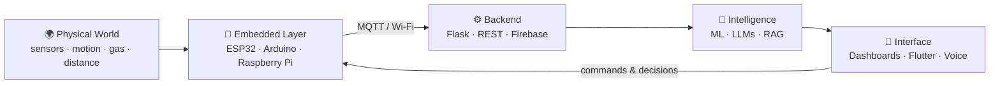
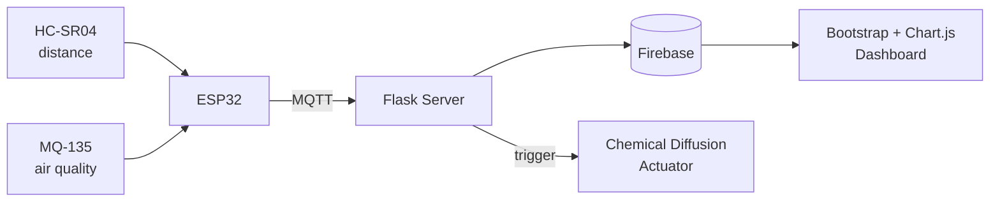

<div align="center">


<br>

<a href="https://github.com/Misbah81"></a>
&nbsp;
<a href="https://www.linkedin.com/in/misbah-rafique-b6935933a"></a>
&nbsp;


<br><br>


</div>

---

## ⚡ Boot Sequence

```python
class Misbah:
    name     = "Misbah Muhammad Rafique"
    role     = "Computer Engineering Student"
    domains  = ["Software", "Artificial Intelligence", "Embedded Systems"]
    obsessed = "How software and hardware can solve real-world problems"
    now      = ["AI/ML", "Generative AI", "Intelligent Embedded Systems"]
    method   = "Build it. Break it. Understand it. Build it better."

    def mission(self):
        return "Put a brain inside every circuit I build."
```

> 💡 I don't just write code that runs on screens. I write code that **senses, decides, and acts** in the physical world.

---

## 🧠 Core Stack

**AI / ML**


**Generative AI**


**Backend**


**Application Development**


**Embedded / IoT**


**Tools**


---

## 🛠️ Technologies

<div align="center">


<br><br>


<br><br>


</div>

---

## 🔭 The Big Picture



> Everything I build lives somewhere on this loop: **sense → transmit → think → act.**

---

## 🚀 Selected Work

<table>
<tr>
<td width="50%" valign="top">

### 🐀 Intelligent Rodent Monitoring System
IoT monitoring with **automated chemical diffusion**, designed for critical infrastructure environments.

`ESP32` `MQTT` `HC-SR04` `MQ-135` `Firebase` `Flask` `Bootstrap` `Chart.js`

[**View Repository →**](https://github.com/Misbah81/IOT_based_Rodent-detection-system)

</td>
<td width="50%" valign="top">

### 👣 Footstep Power Generation
Turns human footsteps into measurable electrical energy using **piezoelectric sensors** and an Arduino measurement system.

`Arduino Uno` `Piezoelectric` `Voltage Sensor` `I2C LCD`

[**View Repository →**](https://github.com/Misbah81/Footstep-Power-Generation)

</td>
</tr>
<tr>
<td width="50%" valign="top">

### 💡 Raspberry Pi LED Control
Remote control of an LED from anywhere through the **Blynk IoT platform**.

`Raspberry Pi` `Python` `Blynk` `GPIO`

[**View Repository →**](https://github.com/Misbah81/Control-LED-with-Raspberry-Pi-using-Blynk-App)

</td>
<td width="50%" valign="top">

### 🎙️ Python Voice Assistant
Explores speech recognition, voice commands, and basic task automation.

`Python` `Speech Recognition` `Text-to-Speech`

[**Explore Repository →**](https://github.com/Misbah81)

</td>
</tr>
</table>

<details>
<summary><b>🔍 How the Rodent Monitoring System flows (click to expand)</b></summary>

<br>



</details>

---

## 🗺️ Areas of Exploration

```text
Artificial Intelligence
        │
        ├── Machine Learning
        ├── Generative AI
        ├── LLM Applications
        └── RAG & Local Models
                │
                ▼
        Intelligent Systems
                ▲
                │
        Embedded & IoT
        ├── ESP32
        ├── Arduino
        ├── Raspberry Pi
        └── MQTT
                │
                ▼
        Software Development
        ├── Python
        ├── Flask
        └── Flutter
```

---

## 🎯 Current Quest Log

| Quest | Status |
|:--|:--:|
| Build RAG apps that run fully on local LLMs with Ollama | 🟡 In progress |
| Combine ML models with live ESP32 sensor data | 🟡 In progress |
| Agent workflows with LangGraph | 🔵 Exploring |
| Cross-platform dashboards and control apps in Flutter | 🔵 Exploring |
| Ship projects with clean READMEs, diagrams, and demos | 🟢 Always |

---

## 📊 GitHub Activity

<div align="center">


<br>


</div>

### Contribution Graph

<div align="center">


</div>

---

## 🤝 Let's Connect

I'm open to **internships, collaborations, and projects** in AI, embedded systems, and software. If you're building something where code meets hardware, say hello.

<div align="center">

### Let's build something meaningful.

<a href="https://github.com/Misbah81"></a>
&nbsp;
<a href="https://www.linkedin.com/in/misbah-rafique-b6935933a"></a>
&nbsp;


<br><br>


</div>
