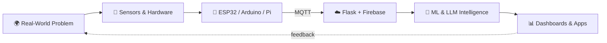

<div align="center">


<br><br>

<a href="https://github.com/Misbah81"></a>
<a href="https://www.linkedin.com/in/misbah-rafique-b6935933a"></a>


</div>

---

## 👋 Hello, World

```python
class Misbah:
    role      = "Computer Engineering Student"
    focus     = ["Software", "Artificial Intelligence", "Embedded Systems"]
    mindset   = "Learn by building. Break it. Fix it. Ship it."
    exploring = ["Generative AI", "RAG", "Local LLMs", "Intelligent Embedded Systems"]

    def current_goal(self):
        return "Make software and hardware solve real-world problems together."
```

I build practical systems — from **Python apps and IoT devices** to **machine learning and intelligent automation** — and I'm happiest where code meets circuits.

---

## 🧰 Core Stack

### 🧠 AI / Machine Learning


### ✨ Generative AI


### ⚙️ Backend


### 📱 Application Development


### 🔌 Embedded / IoT


### 🛠️ Tools


---

## 🚀 Featured Projects

<div align="center">

<a href="https://github.com/Misbah81/IOT_based_Rodent-detection-system">
  
</a>
<a href="https://github.com/Misbah81/Footstep-Power-Generation">
  
</a>
<br>
<a href="https://github.com/Misbah81/Control-LED-with-Raspberry-Pi-using-Blynk-App">
  
</a>

</div>

<table>
<tr>
<td width="50%" valign="top">

### 🐀 IoT-Based Intelligent Rodent Monitoring System
An IoT monitoring and **automated chemical diffusion** system designed for critical-infrastructure environments.

`ESP32` `MQTT` `HC-SR04` `MQ-135` `Firebase` `Flask` `Bootstrap` `Chart.js`

[**View Repository →**](https://github.com/Misbah81/IOT_based_Rodent-detection-system)

</td>
<td width="50%" valign="top">

### 👣 Footstep Power Generation
Electrical energy harvested from **human footsteps** using piezoelectric sensors, with live measurement on an Arduino.

`Arduino Uno` `Piezoelectric Sensors` `Voltage Sensor` `I2C LCD`

[**View Repository →**](https://github.com/Misbah81/Footstep-Power-Generation)

</td>
</tr>
<tr>
<td width="50%" valign="top">

### 💡 Raspberry Pi LED Control
Remote LED control from anywhere through the **Blynk IoT** platform.

`Raspberry Pi` `Python` `Blynk` `GPIO`

[**View Repository →**](https://github.com/Misbah81/Control-LED-with-Raspberry-Pi-using-Blynk-App)

</td>
<td width="50%" valign="top">

### 🎙️ Python Voice Assistant
Speech recognition, voice commands, and basic task automation — talking to your computer, literally.

`Python` `Speech Recognition` `Text-to-Speech`

[**Explore Repository →**](https://github.com/Misbah81)

</td>
</tr>
</table>

---

## 🧭 How I Think About Systems



---

## 🔭 Currently Exploring

| 🧪 Area | 🎯 What I'm into |
|---|---|
| **Generative AI** | LLM applications, RAG pipelines, agents with LangChain & LangGraph |
| **Local Models** | Running and experimenting with LLMs on my own machine via Ollama |
| **Intelligent Embedded** | Bringing ML-driven decisions to ESP32 / Raspberry Pi devices |
| **App Development** | Flutter apps connected to Firebase and Flask backends |

---

## 📊 GitHub Activity

<div align="center">


</div>

---

<div align="center">

### 💬 Let's build something meaningful.

<a href="https://github.com/Misbah81"></a>
<a href="https://www.linkedin.com/in/misbah-rafique-b6935933a"></a>


</div>
